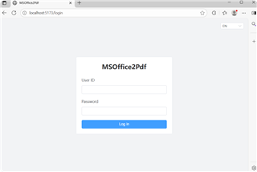
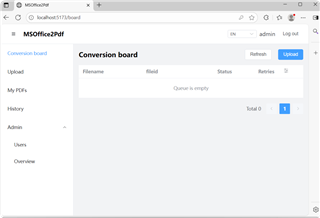
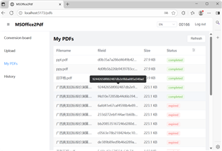

# MSOffice2Pdf

Convert Microsoft Office documents to PDF via HTTP API + optional Web UI.

- **Windows**: Microsoft Office / WPS via COM for high-fidelity conversion.
- **Linux**: configure **LibreOffice** or **Apache OpenOffice** (`soffice` CLI, engine `openoffice`) for PDF conversion.

One service instance supports **multi-user**, **multi-task**, and **multi-thread** conversion (channel queue + configurable Worker Pool), with **unified management** of users, uploads, PDFs, history, and cleanup through the same Web UI / REST API / database.

## Requirements

- Go 1.21+
- MySQL 8.0+ or PostgreSQL 14+
- **Windows** + Microsoft Office 2016+ (or WPS) for COM engines (`msoffice` / `wpsoffice`)
- **Linux** (or macOS): LibreOffice / Apache OpenOffice installed; enable engine `openoffice` in `config.yaml` (real CLI conversion; no Microsoft Office COM)

### Linux: LibreOffice / OpenOffice

Install LibreOffice (or Apache OpenOffice), then in `config/config.yaml` enable only the `openoffice` engine and map extensions to it. Each task uses an isolated profile under `user_profile/{uuid}/` so **multiple workers can convert in parallel** without interfering:

```yaml
converter:
  worker_count: 4          # multi-thread / multi-task workers
  queue_size: 64
  engines:
    - openoffice
  ext_engines:
    "*.doc": openoffice
    "*.docx": openoffice
    "*.xls": openoffice
    "*.xlsx": openoffice
    "*.ppt": openoffice
    "*.pptx": openoffice
  openoffice:
    command: "/usr/bin/soffice"   # or soffice on PATH
    user_profile: "/var/lib/msoffice2pdf/lo-profile"
```

Do not list `msoffice` / `wpsoffice` on Linux (startup will exit). Users, tasks, and PDFs are still managed in one place via Web UI / API / DB.

## Quick start (P1 skeleton)

1. Create the MySQL database (see [Create MySQL database](#create-mysql-database) below), or use the Docker example.
2. Copy an annotated template and edit secrets: `cp config/config.template_en.yaml config/config.yaml` (or `config.template_zh.yaml`; set `database.dsn`, `auth.jwt_secret`).
   - **Sync rule:** any config **key** added/removed/renamed in `config.yaml` must be reflected in both `config/config.template_en.yaml` and `config/config.template_zh.yaml` (comments + key). Values may differ.
3. Optional: `export MSOFFICE2PDF_DB_DSN='...'` / `MSOFFICE2PDF_JWT_SECRET='...'`
4. Build and run:

```bash
go build -o bin/msoffice2pdf ./cmd/msoffice2pdf
./bin/msoffice2pdf --config config/config.yaml
```

On **Windows**, the desktop shell (Fyne) needs **CGO** and a **matching `GOARCH`**. If `go env GOARCH` is `arm64` but your CPU/MinGW toolchain is amd64, build with:

```bash
GOARCH=amd64 CGO_ENABLED=1 go build -o bin/msoffice2pdf.exe ./cmd/msoffice2pdf
```

By default on **Windows** (and on **Linux when `DISPLAY` is set**), the process opens a **desktop control shell**. Click **Start** to run HTTP + conversion workers. Use **`--noui`** for classic console mode (starts immediately; suitable for SSH/service wrappers):

```bash
./bin/msoffice2pdf --noui --config config/config.yaml
```

5. After the service is running (click **Start** in the desktop shell, or use `--noui`), health-check: `curl -i http://127.0.0.1:8080/health`

### Create MySQL database

On Windows, with `mysql` on `PATH`, run from the project root (prompts for the MySQL root password):

```bat
mysql_db.bat
```

This executes `mysql_db.sql`: creates database `msoffice2pdf` (utf8mb4), optional user `msoffice2pdf`/`msoffice2pdf`, and business tables. Equivalent one-liner:

```bash
mysql -u root -p < mysql_db.sql
```

Then set `database.dsn` in `config/config.yaml`, e.g.:

`msoffice2pdf:msoffice2pdf@tcp(127.0.0.1:3306)/msoffice2pdf?charset=utf8mb4&parseTime=True&loc=Local`

### Docker MySQL example

```bash
docker run -d --name msoffice2pdf-mysql -e MYSQL_ROOT_PASSWORD=root -e MYSQL_DATABASE=msoffice2pdf -p 3306:3306 mysql:8
# dsn: root:root@tcp(127.0.0.1:3306)/msoffice2pdf?charset=utf8mb4&parseTime=True&loc=Local
```

## Web UI

Standalone Vite + Vue 3 app in `ui/`, calling the backend via same-origin `/api`. Dev uses the Vite proxy; production serves `ui/dist/` (e.g. Nginx) and reverse-proxies the API.

### Screenshots

  

### Prerequisites

1. Backend running (default `http://127.0.0.1:8080`)
2. A login user created via CLI (e.g. `user create-admin`)

### Dev start

```bash
# Terminal 1: backend
./bin/msoffice2pdf.exe serve --config=config/config.yaml

# Terminal 2: frontend
cd ui
npm install
npm run dev
```

Open the URL Vite prints (default `http://127.0.0.1:5173`). `ui/vite.config.ts` proxies `/api` and `/health` to `http://127.0.0.1:8080`. Cookie sessions need same-origin proxy; do not point the API at a cross-origin host. Login uses an HttpOnly cookie; do not rely on `X-UID` / `X-Token` in the browser.

### Production build

```bash
cd ui
npm run build
```

Output is in `ui/dist/`. Nginx example — set site `root` to that directory and reverse-proxy `/api` (and optionally `/health`) to the backend:

```nginx
server {
  listen 80;
  server_name example.com;
  root /path/to/msoffice2pdf/ui/dist;
  index index.html;

  location /api/ {
    proxy_pass http://127.0.0.1:8080;
    proxy_set_header Host $host;
    proxy_set_header X-Real-IP $remote_addr;
    proxy_set_header X-Forwarded-For $proxy_add_x_forwarded_for;
  }

  location /health {
    proxy_pass http://127.0.0.1:8080;
  }

  location / {
    try_files $uri $uri/ /index.html;
  }
}
```

### Usage

1. Open the login page; sign in with `uid` + `pwd` (same as CLI create)
2. After login you land on the conversion board (`/board`). Sidebar:
   - **Upload** (`/upload`) — pick/drag Office files and submit conversion
   - **Conversion board** (`/board`) — in-progress jobs
   - **My PDFs** (`/pdfs`) — browse/download generated PDFs
   - **History** (`/history`) — archived uploads and action history
   - **Profile** (`/profile`) — change password, view/regenerate API token, usage stats
3. **Admin** (`role=admin`) also sees:
   - **Users** (`/admin/users`)
   - **Overview** (`/admin/overview`)
4. UI language: EN / 中文 switcher (top right)

## Authentication (P2)

Passwords are stored as **MD5** (lowercase hex) in `pwd_hash` (project decision for P2; see `docs/superpowers/specs/2026-08-04-p2-auth-users-design.md`).

Two credential types:

| Use case | Headers / body | Notes |
|----------|----------------|-------|
| Web login | `POST /api/auth/login` with `{"uid","pwd"}` | Returns short-lived **JWT** in JSON `token` and `access_token` cookie |
| API access | `X-UID` + `X-Token` | Long-lived API token from user creation/reset; **no login required** |
| Either | `Authorization: Bearer <jwt>` or cookie | Same as login JWT |

### CLI user commands

Create the first admin (prints `api_token` once):

```bash
./bin/msoffice2pdf user create-admin --uid=admin --pwd=secret --config=config/config.yaml
```

Other commands:

```bash
./bin/msoffice2pdf user create --uid=u1 --pwd=secret --config=config/config.yaml
./bin/msoffice2pdf user reset-token --uid=u1 --config=config/config.yaml
./bin/msoffice2pdf user deactivate --uid=u1 --config=config/config.yaml
./bin/msoffice2pdf user activate --uid=u1 --config=config/config.yaml
```

### Login (JWT)

```bash
curl -s -X POST http://127.0.0.1:8080/api/auth/login \
  -H 'Content-Type: application/json' \
  -d '{"uid":"admin","pwd":"secret"}'
```

Example success body: `{"code":0,"data":{"uid":"admin","token":"<jwt>","role":"admin"}}`

Wrong password → HTTP 401. Frozen user → HTTP 403.

### Verify credentials

With JWT (from login):

```bash
curl -s http://127.0.0.1:8080/api/auth/verify \
  -H "Authorization: Bearer <jwt>"
```

With API token (no prior login):

```bash
curl -s http://127.0.0.1:8080/api/auth/verify \
  -H "X-UID: admin" \
  -H "X-Token: <api_token>"
```

Success returns `uid`, `role`, and `status`. Invalid credentials → 401; frozen → 403.

## Upload (P3)

Configured in `config.yaml` under `upload`:

- `max_size` — e.g. `100MB` (also supports KB/GB or raw bytes)
- `allowed_exts` — patterns with `*` wildcards (`*.docx`, `doc`, or `*` for any)

Upload stores files under `upload/{uid}/{fileid}_{filename}`. After upload the service tries to enqueue conversion (`queued`); if the memory queue is full the row stays `pending` until the requeue scanner picks it up (`converter.requeue_interval`). Delete moves the file to `trash/` and soft-deletes the row.

```bash
# upload (optional X-Request-ID echoed in JSON as request_id + response header)
curl -s -X POST http://127.0.0.1:8080/api/upload \
  -H "X-UID: u1" -H "X-Token: <api_token>" \
  -H "X-Request-ID: client-req-001" \
  -F "file=@/path/to/report.docx"

# list mine
curl -s "http://127.0.0.1:8080/api/uploads?page=1&page_size=20" \
  -H "X-UID: u1" -H "X-Token: <api_token>"

# download / delete
curl -s -OJ http://127.0.0.1:8080/api/upload/<fileid>/download \
  -H "X-UID: u1" -H "X-Token: <api_token>"
curl -s -X DELETE http://127.0.0.1:8080/api/upload/<fileid> \
  -H "X-UID: u1" -H "X-Token: <api_token>"

# admin list all
curl -s "http://127.0.0.1:8080/api/admin/uploads" \
  -H "X-UID: admin" -H "X-Token: <admin_api_token>"
```

## Conversion & PDF (P4)

Configured under `converter` in `config.yaml`:

- `worker_count` / `queue_size` / `office_timeout`
- `requeue_interval` — scan DB for `pending|queued|converting` and refill the channel by `upload.id` ascending

On Windows, conversion uses Office COM (go-ole). On non-Windows builds a stub writes a minimal PDF so the queue/API can be exercised.

`:fileid` in PDF routes is the unified business fileid (generated at upload; shared by upload / pdf / pdflog / disk paths).

```bash
# status — live upload first, else upload_history snapshot (after archive)
curl -s http://127.0.0.1:8080/api/pdf/<fileid>/status \
  -H "X-UID: u1" -H "X-Token: <api_token>"

# download PDF (works after archive via history.upload_id; 409 if not completed)
curl -s -OJ http://127.0.0.1:8080/api/pdf/<fileid>/download \
  -H "X-UID: u1" -H "X-Token: <api_token>"

# list PDFs
curl -s "http://127.0.0.1:8080/api/pdfs?page=1&page_size=20" \
  -H "X-UID: u1" -H "X-Token: <api_token>"

# history — from upload_history (final_status / error_* / archive_dir); not the live upload queue
curl -s "http://127.0.0.1:8080/api/history/uploads" \
  -H "X-UID: u1" -H "X-Token: <api_token>"
curl -s "http://127.0.0.1:8080/api/history/pdflogs" \
  -H "X-UID: u1" -H "X-Token: <api_token>"
```

Real COM conversion needs Windows + licensed Office. For DCOM Identity setup see architecture §3; Windows Service install is deferred (not in P5).

## Cleanup (P5+)

Configured under `cleanup` in `config.yaml`:

- **Immediate archive** — on convert success, retry exhaustion, or user delete: `ArchiveUpload` moves Office source to `expired/` or `trash/`, writes `upload_history`, hard-deletes the `upload` row (no long-lived `completed` in `upload`)
- `history_ttl_enabled` / `history_ttl` / `history_ttl_delete_row` — optional TTL on archived Office files under `upload_history` (relative to `finished_at`); when enabled, delete files and optionally soft-delete history rows
- `pdf_ttl` — delete `completed` PDF files older than this; set pdf `status=expired`, write `pdflog` action `expire`
- `interval` — how often the cleaner runs (also runs once at startup)
- **`upload_ttl` deprecated** — read but ignored; startup WARN if still present
- **`expired_upload` legacy** — no new writes; startup migrates old rows into `upload_history` (AutoMigrate still registers both tables)

User delete still moves files to `trash/` via `ArchiveUpload`; there is **no** trash TTL in this release.

Windows Service install/start is **not** in P5 (deferred).

## License

This project is released under the [MIT License](./LICENSE).

Copyright (c) 2026 pigoosoft (pigoosoft@gmail.com)

