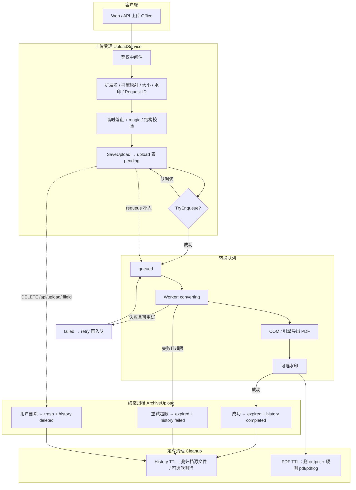
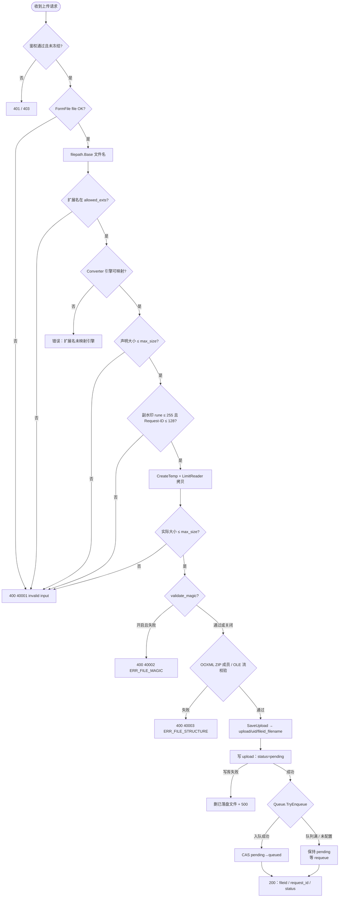
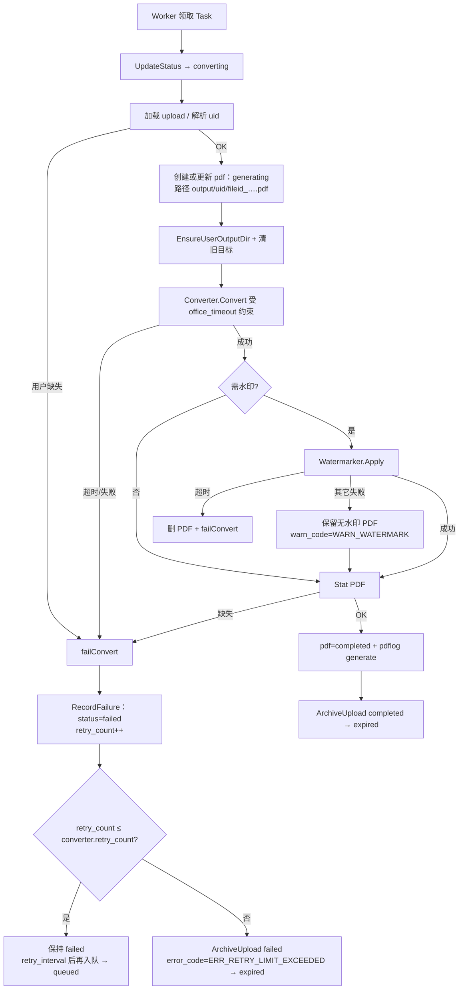
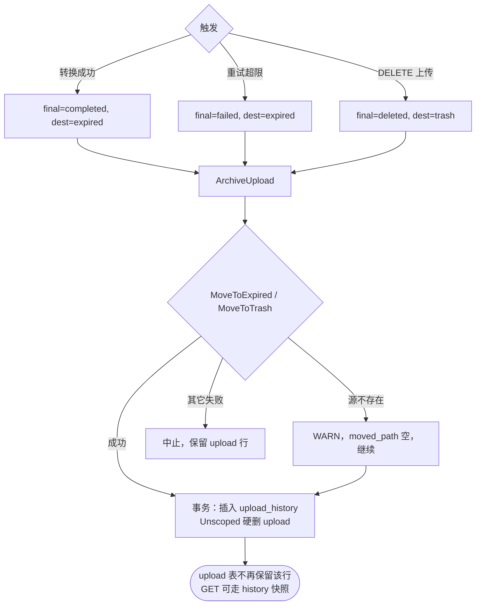
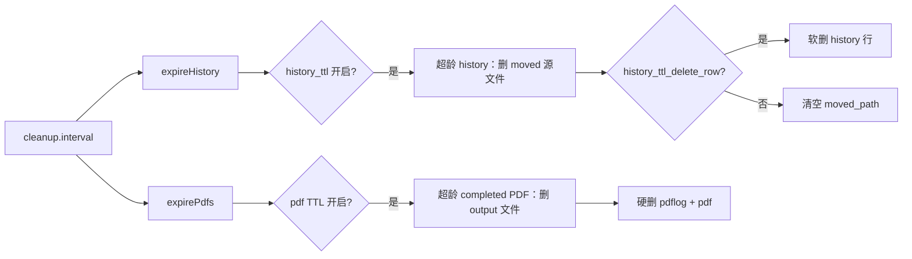
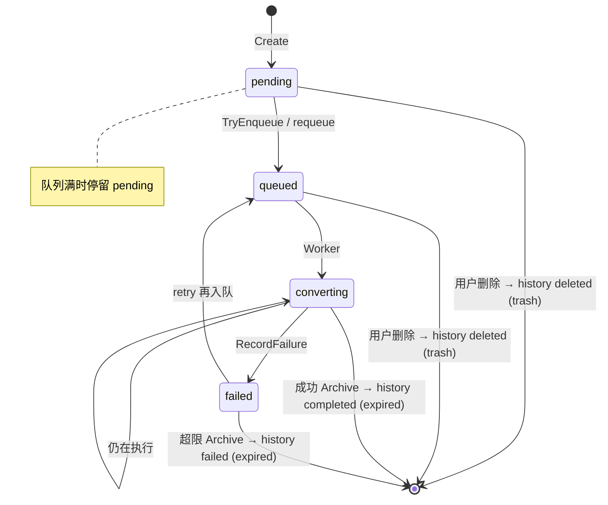
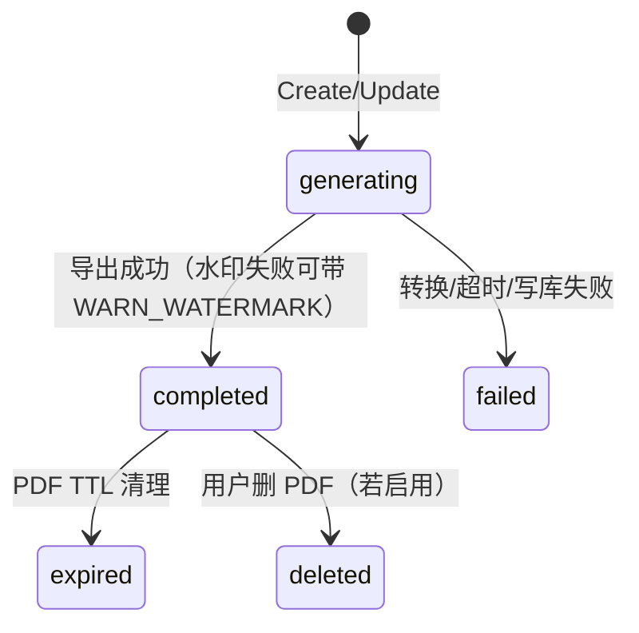

# 上传 → 转换 → 归档 流程

| 项 | 内容 |
|----|------|
| 文档类型 | 流程说明（详细设计配套） |
| 系统名称 | MSOffice2Pdf |
| 当前版本 | v1.0.0 |
| 最后更新 | 2026-08-11 |
| 配套文档 | [详细设计说明书.md](./详细设计说明书.md)、[架构设计说明书.md](./架构设计说明书.md) |

本文用分层流程图描述**当前实现**：从 HTTP 上传受理，经队列 Worker 转 PDF，到 `ArchiveUpload` 与定时清理。算法级约定以《详细设计说明书》§2.3–§2.6 为准。

---

## 1. 总览

---

## 2. 上传受理（到 queued / pending）

入口：`POST /api/upload`（multipart `file`；可选表单 `watermark`；可选 Header `X-Request-ID`）。

要点：

- 校验失败：**不入正式盘、不入库、不入队**（临时文件在 defer 中删除）。
- 写库成功后入队失败：记录留在 `pending`，由 `requeue_interval` 周期 `ListForRequeue` 补入。
- 入队后仅当仍为 `pending` 时才更新为 `queued`，避免覆盖 Worker 已推进的状态。

---

## 3. 转换与重试

辅助循环：

| 循环 | 选取 | 行为 |
|------|------|------|
| requeue | `pending\|queued\|converting` | `TryEnqueue`；仅 `pending`→`queued` |
| retry | `failed` 且 `retry_count ≤ retry_count` 且已过间隔 | `TryEnqueue`；`failed`→`queued` |

`retry_count` 配置为**额外**次数：配置为 2 时最多尝试 3 次；第 3 次失败后 `retry_count` 变为 3，触发超限归档。

---

## 4. 归档与用户删除

说明：

- `upload` 表仅保留待转/进行中记录；终态立刻归档。
- 归档目录按 `expired|trash` + 按日路径；`archive_dir` / `moved_path` 写入 `upload_history`。

---

## 5. 定时清理（归档之后）

（CSV 审计等细节见《详细设计说明书》§2.6；以当前配置键与实现为准。）

---

## 6. 状态机

### 6.1 upload（活表）→ upload_history.final_status

活表上的 `completed` / `deleted` 等终态字符串主要用于 history 的 `final_status`；成功路径在 Worker 内直接归档，不长期停留在 `upload.completed`。

### 6.2 pdf

---

## 7. 与代码入口对照

| 阶段 | 主要代码 |
|------|----------|
| HTTP | `internal/handlers/upload.go` → `UploadService.Upload` |
| 校验 | `internal/validate` + `config.UploadConfig` |
| 落盘 | `internal/storage.SaveUpload` |
| 入队 / Worker | `internal/queue`（`TryEnqueue` / `process` / requeue / retry） |
| 转换 | `internal/converter` |
| 归档 | `CleanupService.ArchiveUpload` |
| 删除上传 | `UploadService.Delete` → trash |
| 查询终态 | `GetDetail`：先 `upload`，再 `upload_history`；客户端亦可用 `GET /api/pdf/events`（SSE）替代轮询 `status` |

---

## 文档变更记录

| 版本 | 日期 | 变更内容 | 作者 |
|------|------|----------|------|
| v1.0.0 | 2026-08-11 | 初版：分层流程图 + 状态机（对齐当前实现） | — |
