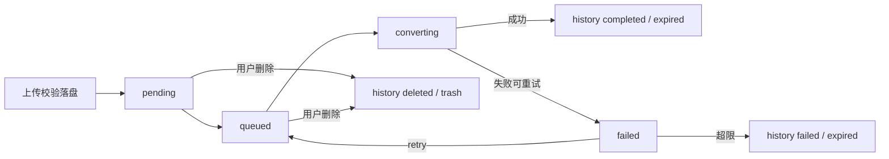
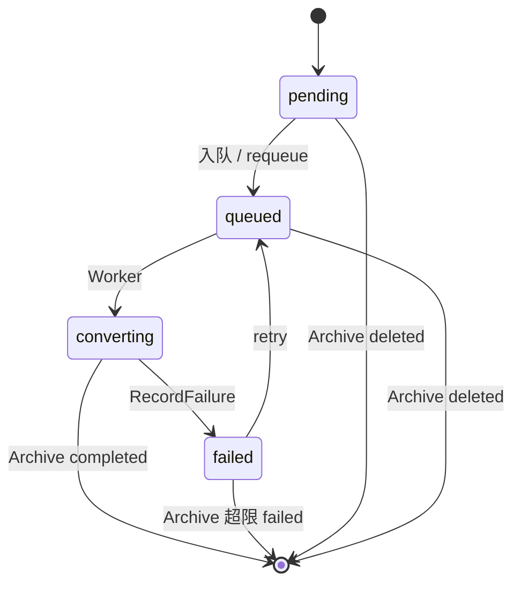

# MSOffice2Pdf 详细设计说明书

| 项 | 内容 |
|----|------|
| 文档类型 | 软件详细设计说明书 |
| 系统名称 | MSOffice2Pdf |
| 当前版本 | v1.2.0 |
| 最后更新 | 2026-08-11 |
| 维护人 | Admin |
| 配套文档 | 《架构设计说明书》《使用文档》《上传转换流程》；配置键说明见 `config/config.template_zh.yaml` / `config/config.template_en.yaml` |

本文描述模块职责、数据结构设计、接口设计、转换与清理算法级约定。总体分层与部署见《架构设计说明书》。操作步骤与 curl 示例见《使用文档》。**上传→转换→归档完整流程图**见 [上传转换流程.md](./上传转换流程.md)。

---

## 文档变更记录

| 版本 | 日期 | 变更内容 | 作者 | 关联Issue/PR |
|------|------|----------|------|--------------|
| v1.2.1 | 2026-08-11 | §4.2/§4.4 新增 GET /api/pdf/events（转换状态 SSE） | — | - |
| v1.2.0 | 2026-08-11 | §2.0 增补主流程总览与状态机；配套《上传转换流程》；自归档恢复本文至 docs/ | — | - |
| v1.1.0 | 2026-08-07 | cleanup.interval 记录归档输出 CSV，文件入trash, 以备后期审计 | admin | #145 |
| v1.0.0 | 2026-08-04 | 初始版本 | admin | - |

---

## 1. 引言

### 1.1 编写目的

指导编码实现与联调验收，使实现与架构约束一致。

### 1.2 设计约束（摘自架构）

- HTTP 路径不同步执行 Office COM
- `upload` 表仅待转；终态立刻 `ArchiveUpload`
- 源 Office 长期保留（不物理删除）；PDF 可随表归档删除
- 密码 MD5；认证 JWT + API Token

---

## 2. 模块设计

### 2.0 主流程总览（缩略）

完整分层图、错误分支与代码入口对照见 **[上传转换流程.md](./上传转换流程.md)**。以下为规范内嵌的缩略总览与状态机。



**upload 活表状态（缩略）：**



### 2.1 模块一览

| 模块 | 路径（建议） | 职责 |
|------|--------------|------|
| 配置 | `internal/config` | 加载 YAML、环境变量覆盖、Validate |
| 领域 | `internal/domain` | 实体与状态常量、错误码 |
| 仓储 | `internal/repo` | GORM 访问 |
| 用户服务 | `internal/service` User | 登录、JWT、用户管理、Token |
| 上传服务 | Upload | 校验编排、落盘、入队、删除归档 |
| PDF 服务 | Pdf | 状态、下载、列表、pdflog |
| 清理服务 | Cleanup | ArchiveUpload、迁盘、CSV 归档 |
| 队列 | `internal/queue` | channel、Worker、requeue/retry |
| 转换 | `internal/converter` | COM / stub、水印后处理入口 |
| 校验 | `internal/validate` | 魔数、OOXML/OLE 结构 |
| 存储 | `internal/storage` | 路径、MoveToExpired/Trash、CSV 追加 |
| HTTP | handlers / middleware / server | 路由与鉴权 |
| 入口 | `cmd/msoffice2pdf` | 主进程、CLI、`convert-worker` |

### 2.2 认证与权限

| 凭证 | 用途 |
|------|------|
| `POST /api/auth/login` → JWT | 短时会话；`Authorization: Bearer` 或 Cookie `access_token`；过期 `auth.token_expire` |
| Header `X-UID` + `X-Token` | 长期 API Token，存 `user.token` |
| CLI | `user create-admin` / `create` / `reset-token` / `deactivate` / `activate` |

中间件：校验凭证 → 查用户 → 冻结则 403；管理员路由另需 AdminRequired。  
密码：MD5 小写 hex 写入 `pwd_hash`。

可选：`server.allow_ips`（`*` / IP / CIDR），全局中间件，含 `/health`；拒绝 403。

### 2.3 上传校验流水线

流程图（校验→落盘→入队）见 [上传转换流程.md §2](./上传转换流程.md#2-上传受理到-queued--pending)。

落盘与写库**之前**完成；失败不入盘、不入库、不入队：

1. 扩展名与大小：`upload.allowed_exts` / `max_size`
2. 魔数（`validate_magic`，缺省 true）：OLE `D0 CF 11 E0…` 或 ZIP `PK`，须与扩展名家族一致（家族由扩展名归属 `validate_new` 或 `validate_ole` 决定）
3. 结构：OOXML 查 ZIP 必选路径；OLE 查复合文档流名；每个 allowed 扩展须恰好出现在二者之一
4. `SaveUpload` → 尝试入队（满则 `pending`，由 requeue 补入）

| 情况 | HTTP | code |
|------|------|------|
| 参数/后缀/过大 | 400 | 40001 |
| 魔数不符 | 400 | 40002 |
| 结构不符 | 400 | 40003 |

可选 Header `X-Request-ID`（≤128）→ `request_id`；可选表单副水印 → `watermark_text`。

### 2.4 转换队列与 Worker

流程图（Worker / 重试 / 成功归档）见 [上传转换流程.md §3](./上传转换流程.md#3-转换与重试)。

**任务字段：** upload_id、fileid、源路径、目标 PDF 路径、user_id。

**状态：** pending → queued → converting →（成功归档 | failed 待重试 | 超限归档）。

**配置：**

| 键 | 含义 |
|----|------|
| worker_count / queue_size | 并发与 channel 容量 |
| office_timeout | 单任务超时 |
| requeue_interval | 补入 pending\|queued\|converting；孤儿 worker / TEMP 清扫 |
| retry_count / retry_interval | 额外重试次数与再入队等待 |

**COM 模式 `com_mode`：**

| 值 | 行为 |
|----|------|
| subprocess（默认） | exec 本程序 `convert-worker`；超时关 Job Object（KILL_ON_JOB_CLOSE）杀子进程树 |
| inprocess | Worker 内 go-ole；与 `temp_sandbox` 同开时强制 worker_count=1 |

禁止 PowerShell / SendKeys 作主路径。

**TEMP 沙箱（缺省 true）：** 每任务 `msoffice2pdf-com-<id>/`，设 TEMP/TMP/TMPDIR；不复制源文件到 TEMP；结束 RemoveAll。

### 2.5 COM 转换细则

打开前：Visible=false、DisplayAlerts=none、AutomationSecurity=ForceDisable。

| 应用 | 导出 |
|------|------|
| Word | SaveAs2，格式 17 |
| Excel | ExportAsFixedFormat；`excel_page_fit` 默认 fit_width（FitToPagesWide=1），auto 不改 PageSetup |
| PowerPoint | SaveAs，格式 32 |

打开参数：Word ConfirmConversions=false、ReadOnly；Excel UpdateLinks=0；PowerPoint ppAlertsNone。  
密码/修复向导等：failed 或超时，不阻塞队列。  
正常结束：Close(不保存)+Quit。启动与周期清孤儿 convert-worker 与滞留 Office。

**水印：** `watermark.*` 主水印 + 上传副水印；失败保留无水印 PDF，`pdf.warn_code=WARN_WATERMARK`，status 仍 completed。

**重试：** 每次失败 retry_count++；≤retry_count 则间隔后再入队；超限 ArchiveUpload，error_code=`ERR_RETRY_LIMIT_EXCEEDED`。retry_count 为**额外**次数（2 ⇒ 最多 3 次尝试）。

### 2.6 归档与清理

流程图见 [上传转换流程.md §4–§5](./上传转换流程.md#4-归档与用户删除)。

**ArchiveUpload(u, finalStatus, errorCode, errorMsg, dest)：**  
挪盘（expired|trash，按日目录）→ 插入 upload_history → 硬删 upload。  
成功/重试超限 → expired；用户删除 → trash。

**启动：** 旧 expired_upload 与遗留终态 upload → upload_history（幂等）；扁目录迁按日路径；废弃键 upload_ttl / history_ttl* / pdf_ttl 启动 WARN 并忽略。

**定时（cleanup.interval，启动先跑一轮）：**

History：enabled 且行数>threshold 且 finished_at 超 keep_days → 追加 CSV → 硬删行 → **不删**源文件。  
PDF：同上（按 created_at）→ 追加 pdf/pdflog CSV → 删 output 文件 → 硬删 pdflog+pdf。  
CSV 失败则不删表、不删 PDF。同日追加同一文件。

---

## 3. 数据结构设计

### 3.1 实体关系

```text
user 1──N upload            （pending|queued|converting|failed）
user 1──N upload_history    （completed|failed|deleted 快照）
user 1──N pdf
pdf  1──N pdflog
pdf.upload_id = 原 upload.id（硬删后靠 history.upload_id 关联）
expired_upload              （遗留只读）
```

### 3.2 表字段

#### user

| 字段 | 类型 | 说明 |
|------|------|------|
| id | BIGINT | PK |
| uid | VARCHAR(64) | 唯一 |
| pwd_hash | VARCHAR(255) | MD5 小写 hex |
| token | VARCHAR(255) | API Token |
| role | TINYINT | 0 用户 / 1 管理员 |
| status | TINYINT | 0 正常 / 1 冻结 |
| created_at / updated_at | TIMESTAMP | |

#### upload（待转）

| 字段 | 类型 | 说明 |
|------|------|------|
| id / fileid / user_id | | PK / 唯一 / FK |
| original_name / stored_name / file_path / file_size | | |
| status | VARCHAR(20) | pending\|queued\|converting\|failed |
| error_msg / retry_count / last_failed_at | | |
| watermark_text / request_id | | |
| created_at / updated_at / deleted_at | | deleted_at 兼容字段 |

#### upload_history

| 字段 | 类型 | 说明 |
|------|------|------|
| upload_id / fileid / user_id | | 关联与查询 |
| original_name / stored_name / file_size | | |
| final_status | VARCHAR(20) | completed\|failed\|deleted |
| error_code / error_msg / retry_count | | |
| request_id / watermark_text | | |
| archive_dir | VARCHAR(16) | expired\|trash |
| moved_path | VARCHAR(512) | 相对归档根（含 yyyy/mm/dd） |
| uploaded_at / finished_at / created_at / deleted_at | | |

#### pdf

| 字段 | 说明 |
|------|------|
| fileid / upload_id / user_id / filename / file_path / file_size | |
| status | generating\|completed\|failed\|expired\|deleted |
| warn_code | 水印失败 WARN_WATERMARK |
| expired_at | 兼容字段；归档以 CSV 硬删为主 |

#### pdflog

| 字段 | 说明 |
|------|------|
| pdf_id / action / detail / ip_address / user_agent / created_at | action: generate\|download\|delete\|expire |

#### expired_upload

遗留；启动迁入 upload_history；AutoMigrate 仍注册；不强制 DROP。

### 3.3 文件命名与路径

```text
upload/{uid}/{fileid}_{filename}
output/{uid}/{fileid}_{stem}.pdf
expired|trash/{uid}/{yyyy}/{mm}/{dd}/{uid}_{yyyyMMddHHmmss}_{fileid}_{name}
archive/history/upload_history_{yyyyMMdd}.csv
archive/pdf/pdf_{yyyyMMdd}.csv
archive/pdf/pdflog_{yyyyMMdd}.csv
```

fileid：UUID v4 或同等，约 16–32 位。  
扁目录迁移：解析文件名 datetime，失败用 ModTime；更新 moved_path。

---

## 4. 接口设计

### 4.1 约定

- 统一 JSON；401 未认证；403 无权限/冻结/IP；404 不存在
- PDF 路由 `:fileid` = 统一业务 fileid（上传生成）

### 4.2 路由表

| 方法 | 路径 | 说明 | 权限 |
|------|------|------|------|
| GET | /health | 健康检查 | 公开 |
| POST | /api/auth/login | 登录 | 公开 |
| POST | /api/auth/logout | 登出 | 已认证 |
| GET | /api/auth/verify | 校验凭证 | 已认证 |
| * | /api/admin/users… | CRUD、freeze、reset-token | 管理员 |
| POST | /api/upload | 上传 | 用户 |
| GET | /api/uploads | 待转列表 | 用户 |
| GET | /api/upload/:fileid | 详情（upload→history） | 用户/管理员 |
| GET | /api/upload/:fileid/download | 原文件（仅待转） | 用户/管理员 |
| DELETE | /api/upload/:fileid | 归档删除 | 用户/管理员 |
| GET | /api/admin/uploads | 全部待转 | 管理员 |
| GET | /api/pdf/:fileid/status | 状态 | 用户/管理员 |
| GET | /api/pdf/events | 转换状态 SSE（`?fileid=` 可重复） | 用户/管理员 |
| GET | /api/pdf/:fileid/download | PDF | 用户/管理员 |
| GET | /api/pdfs | PDF 列表 | 用户 |
| GET | /api/admin/pdfs | 全部 PDF | 管理员 |
| GET | /api/history/uploads | 上传历史 | 用户 |
| GET | /api/history/pdflogs | PDF 日志 | 用户 |
| GET | /api/admin/history/uploads\|pdflogs | 全部历史 | 管理员 |

### 4.3 关键报文示例

登录请求：`{"uid":"user001","pwd":"..."}`  
登录响应：`{"code":0,"data":{"uid":"...","token":"<jwt>","role":"user"}}`

上传成功：

```json
{
  "code": 0,
  "data": {
    "fileid": "f8a3d2c1b4e5f6a7",
    "request_id": "client-req-001",
    "filename": "report.docx",
    "status": "queued",
    "upload_time": "2026-08-04T10:30:00Z"
  }
}
```

状态查询（含归档快照字段）：fileid、request_id、status、final_status、error_code、error_msg、retry_count、pdf_filename、created_at、finished_at、completed_at。

历史：`upload_history` 可按 final_status 过滤；pdflog 按 `pdflog.fileid`（与上传生成的 fileid 相同）过滤。

### 4.4 转换状态 SSE（GET /api/pdf/events）

长连接 `text/event-stream`；鉴权与 `GET /api/pdf/:fileid/status` 相同（`X-UID` + `X-Token` 或 Web 会话）。Query：`fileid` 可重复，去重后 1…`server.sse.max_fileids`（默认 50）；任一 fileid 无权或不存在则在开流前返回 4xx（不半开流）。

**事件：**

| event | 说明 |
|-------|------|
| `status` | 与 status 接口相同 JSON；连接建立时对每个 fileid 先发一条快照；轮询周期内仅 fingerprint 变化时再发 |
| `ping` | 空 JSON 心跳，间隔 `server.sse.heartbeat_interval`（默认 15s） |
| `done` | 流结束：`reason=all_terminal`（全部终态）或 `reason=max_duration`（含 `pending` fileid 列表） |

**终态判定：** 与 `PdfService.IsTerminalStatusMap` 一致——`final_status` 为 `completed` / `failed` / `deleted`；活表 `failed`（待重试）不算终态。

**轮询模型：** 服务端按 `server.sse.poll_interval`（默认 1s）调用与 status 相同的查询；最长 `server.sse.max_duration`（默认 5m）后发送 `done` 并关闭。客户端可断线重连。

**WriteTimeout 豁免：** Handler 通过 `http.ResponseController.SetWriteDeadline(time.Time{})` 清除写超时，故 `server.write_timeout` 不限制本流（大文件下载仍受 write_timeout 约束）。

配置键：`server.sse.max_duration`、`heartbeat_interval`、`poll_interval`、`max_fileids`（见配置模板；Validate 要求 poll/heartbeat < max_duration）。

---

## 5. 配置设计

运行配置与模板键必须同步。环境变量：`MSOFFICE2PDF_DB_DSN`、`MSOFFICE2PDF_JWT_SECRET`。

```yaml
server:
  port: 8080
  read_timeout: 30s
  write_timeout: 60s
  allow_ips: "*"

database:
  driver: mysql   # 或 postgres
  dsn: "..."

storage:
  upload_dir: "./upload"
  output_dir: "./output"
  trash_dir: "./trash"
  expired_dir: "./expired"

converter:
  worker_count: 4
  queue_size: 100
  office_timeout: 300s
  requeue_interval: 30s
  retry_count: 2
  retry_interval: 30s
  com_mode: subprocess
  temp_sandbox: true
  excel_page_fit: fit_width

watermark:
  text: ""
  angle: -45
  density: medium
  density_count: 0
  opacity: 0.25
  color: "#808080"
  font_size: 0
  font_path: ""

cleanup:
  history_csv_dir: "./archive/history"
  pdf_csv_dir: "./archive/pdf"
  history_archive_enabled: false
  history_archive_threshold: 1000000
  history_archive_keep_days: 90
  pdf_archive_enabled: false
  pdf_archive_threshold: 1000000
  pdf_archive_keep_days: 90
  interval: 1h

auth:
  jwt_secret: "change-me-in-production"
  token_expire: 48h

log:
  level: info
  output: stdout

upload:
  max_size: 100MB
  validate_magic: true
  allowed_exts: ["*.doc", "*.docx", "*.xls", "*.xlsx", "*.ppt", "*.pptx"]
  # validate_new / validate_ole 完整映射见配置模板
```

**Validate 要点：** cleanup 某侧 archive_enabled 时，对应 csv_dir 非空且 threshold、keep_days > 0；temp_sandbox+inprocess 时 worker_count 必须为 1。

---

## 6. 错误与日志

| code / 符号 | 含义 |
|-------------|------|
| 40001 | 上传参数/类型/大小错误 |
| 40002 | 魔数不符 |
| 40003 | 结构不符 |
| 401 | 认证失败 |
| 403 / 40301 | 权限不足 / IP 未允许 |
| 404 | 资源不存在 |
| ERR_RETRY_LIMIT_EXCEEDED | 转换重试超限归档 |
| WARN_WATERMARK | 水印失败（转换仍成功） |

日志：结构化；禁止输出密码、Token、完整 JWT。

---

## 7. 部署与进程

- 前台：`./msoffice2pdf --config config/config.yaml`（打印本机监听 URL）
- 服务：install/start；优雅停止等待当前转换
- 启动：AutoMigrate、EnsureDirs、清理与扁目录迁移一轮

---

## 8. 相关文档

| 文档 | 说明 |
|------|------|
| [架构设计说明书.md](./架构设计说明书.md) | 总体架构 |
| [上传转换流程.md](./上传转换流程.md) | 上传→转换→归档分层流程图 |
| [usage.md](./usage.md) | 安装与调用 |
| [README.md](./README.md) | 文档索引 |
| `docs/superpowers/specs/` | 历史阶段设计（演进归档） |


## 9. 文档维护策略

### 9.1 变更触发条件

以下情况发生时**必须**同步更新本文档（**强调：必须**）：

| 触发事件 | 对应章节 | 时限 |
|----------|----------|------|
| 数据库表结构变更（增/改/删字段） | 3.2 表字段 | PR 合入前 |
| API 路由新增/修改/删除 | 4.2 路由表 | PR 合入前 |
| 配置键新增/修改/删除 | 第5章 配置设计 | PR 合入前 |
| 模块职责调整（文件移动/重命名） | 2.1 模块一览 | PR 合入前 |
| 转换算法/业务逻辑变更 | 2.4/2.5 转换细则；[上传转换流程.md](./上传转换流程.md) | PR 合入后 3 个工作日内 |
| 错误码新增/修改 | 第6章 错误与日志 | PR 合入后 3 个工作日内 |
| 仅代码重构，外部行为不变 | 无需更新 | - |

### 9.2 变更责任

| 变更类型 | 责任角色 | 检查方式 |
|----------|----------|----------|
| 表结构/API/配置变更 | **开发者本人** | PR 描述中标注“已同步更新详细设计” |
| 业务逻辑变更 | 开发者 + Reviewer | Reviewer 在代码评审时核实文档是否更新 |
| 模块结构调整 | 模块负责人 | 代码评审时检查 |

### 9.3 一致性检查

- **每次发版前**：Release Manager 检查详细设计与本次发布代码的一致性
- **每双周**：开发组内互查，随机抽查一章与实际代码对照
- **每月**：技术负责人抽查一次，结果记录在团队 Wiki

### 9.4 变更记录填写规范

每次更新本文档时，必须在顶部的“文档变更记录”表格中追加一行，包含：
- 版本号（补丁+1，除非新增功能/重大变更）
- 变更日期（格式：YYYY-MM-DD）
- 变更内容摘要（指向具体章节号，如“3.2 表字段”）
- 作者姓名
- 关联的 PR 编号（如适用）